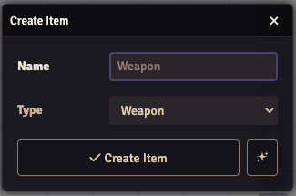
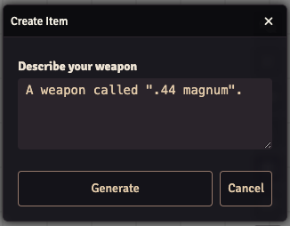
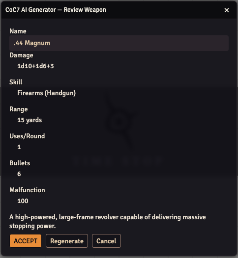
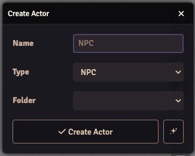
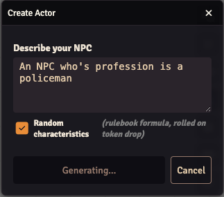
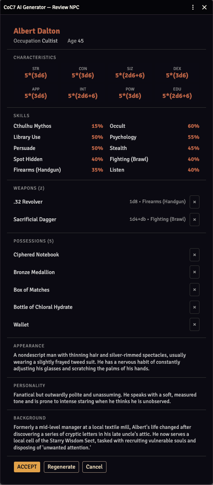
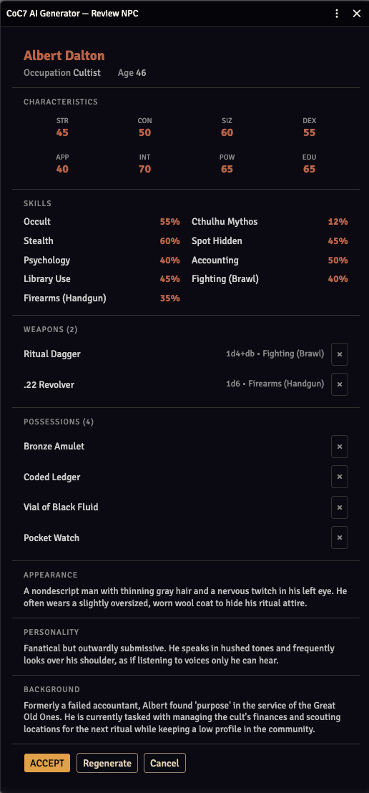
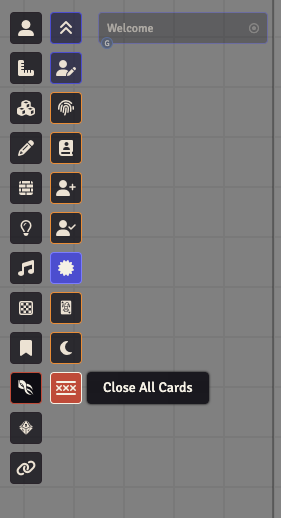
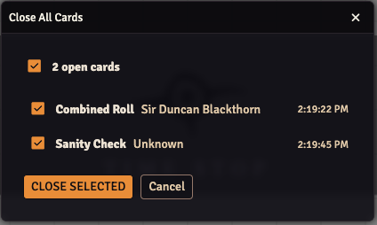
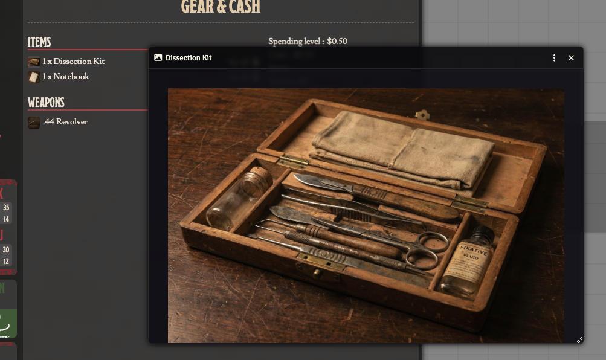

# CoC7 QoL Improvements

A companion module for the [Call of Cthulhu 7th Edition](https://github.com/Miskatonic-Investigative-Society/CoC7-FoundryVTT) system on [FoundryVTT](https://foundryvtt.com/).

## Features

### AI Generation (GM only)

Generate CoC7 content from natural-language descriptions, directly inside FoundryVTT. Supports **Anthropic (Claude)**, **OpenAI (GPT)**, and **Google Gemini**. Configure your provider, API key, endpoint, and model under **Settings → Module Settings → CoC7 QoL Improvements**.

The AI sparkle button appears automatically when a supported type is selected in the creation dialog.

#### Weapon Generation

1. Open the Items sidebar and click **Create Item**
2. Select **Weapon** as the type — a sparkle icon appears

   

3. Click the sparkle, then describe your weapon in plain language (e.g. *"A worn 1920s revolver, .38 calibre, 6-shot cylinder, wood grip"*)
4. Click **Generate** — the module calls your configured LLM and fills in all CoC7 weapon fields

   

5. Review the stats (name, damage, skill, range, ammo…), edit the name if needed, then click **Accept**

   

6. The item is created in your world and its sheet opens immediately

#### NPC Generation

1. Open the Actors sidebar and click **Create Actor**
2. Select **NPC** as the type — a sparkle icon appears

   

3. Click the sparkle, then describe your NPC in plain language (e.g. *"A nervous pharmacist in 1920s Arkham, middle-aged, hides a laudanum habit"*)
4. Optionally tick **Random characteristics** — the AI returns rulebook dice formulas (e.g. `5*(3d6)`) instead of fixed values, so each characteristic is rolled fresh when the token is dropped on the canvas
5. Click **Generate** — the LLM creates a complete NPC with characteristics, skills, and backstory

   

6. Review the full stat block (STR/CON/SIZ/DEX/APP/INT/POW/EDU), skills list, and narrative (appearance, personality, background), then click **Accept**

   <table><tr>
     <td></td>
     <td></td>
   </tr></table>
7. The NPC actor is created with all characteristics set, skills resolved from the CoC7 compendium, and narrative text populated in the biography and keeper notes

Skills are matched against the official CoC7 skills compendium when available, preserving proper skill flags and identifiers. Derived attributes (HP, MP, SAN, MOV, Build, Damage Bonus) are computed automatically by the system.

### Close All Cards (GM only)

GMs can close all open chat cards in one action, directly from the Keeper's toolbar.

1. Click the tentacle-strike icon in the scene controls toolbar to open the Keeper's tools
2. Click the **Close All Cards** button (the ╳-lines icon)

   

3. A dialog lists every open card in the chat log with its type, actor name, and timestamp
4. Use the select-all checkbox or pick individual cards to close

   

5. Click **Close Selected** — the selected cards are resolved and their action buttons removed

This is useful when accumulated open cards block new rolls from being initiated.

### Item Image Popout

Players can click on any item image (weapons, spells, books, skills, etc.) to view the full-size illustration in a draggable, resizable popout window. GMs retain the default file picker behavior.

### Possession Tab Item Image Popout

Players and GMs can click on the small item icon in the Gear & Cash tab of the character sheet to view the full-size illustration in a popout window. Works for all item types shown in that tab: items, weapons, books, spells, armor, talents, and statuses.



## Installation

### From FoundryVTT

1. Go to **Settings > Manage Modules > Install Module**
2. Paste the manifest URL:
   ```
   https://github.com/martin-papy/coc7-qol/releases/latest/download/module.json
   ```
3. Click **Install**

### Manual

1. Download the latest release from the [Releases](https://github.com/martin-papy/coc7-qol/releases) page
2. Extract into your `Data/modules/` directory
3. Restart FoundryVTT

## Compatibility

- **FoundryVTT:** v13+
- **System:** Call of Cthulhu 7th Edition (CoC7) - v8.x

## License

[MIT](LICENSE)
