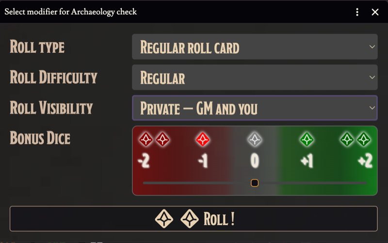
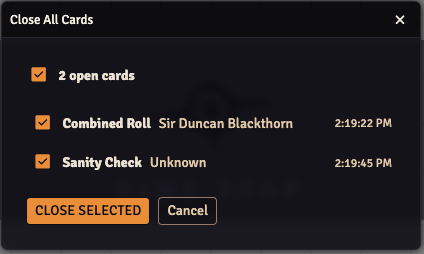
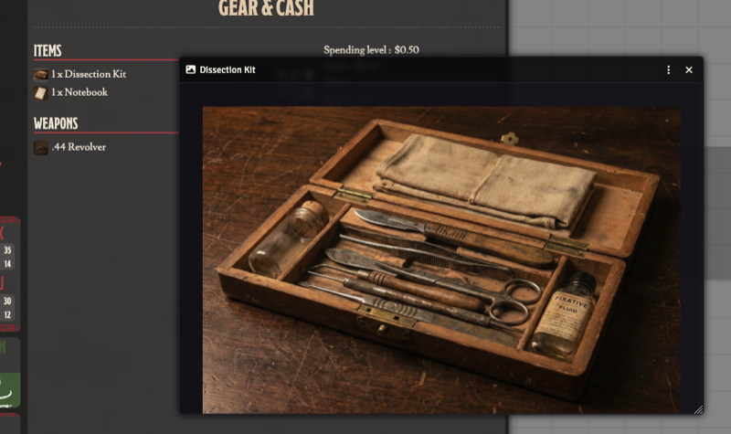
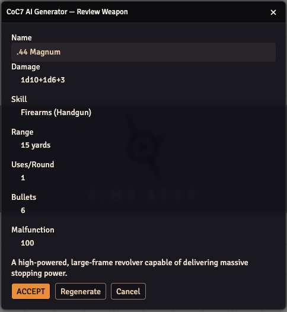
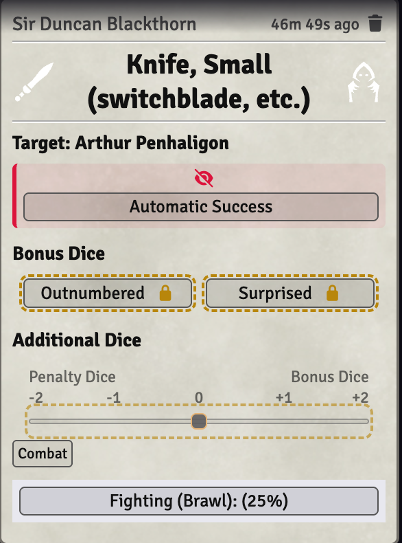
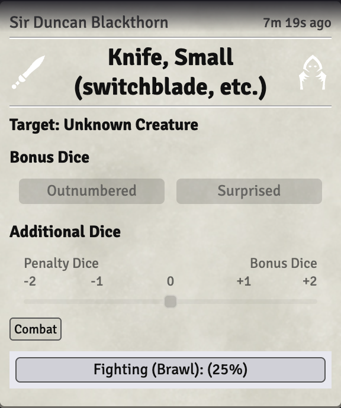
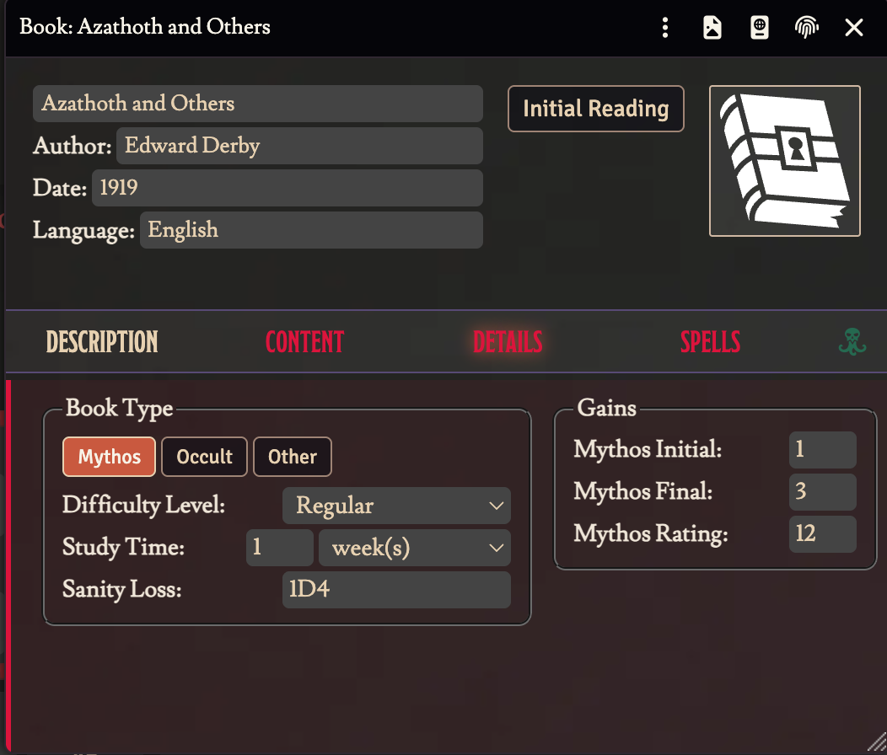
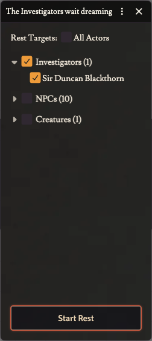
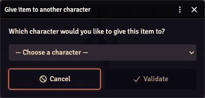

# CoC7 QoL Improvements

A module for the Call of Cthulhu 7th Edition (CoC7) system on FoundryVTT. Adds easy setting of dice roll visibility, keeper-only highlights, image popouts, AI-powered weapon and NPC generation, and bulk card management for GMs.

## Have an idea or a feedback ?

If there's a workflow that annoys you, a small thing that could be smoother, or a feature you keep wishing existed — feel free to open a [GitHub issue](https://github.com/martin-papy/coc7-qol/issues) and describe it. A short note is plenty.

<a href='https://ko-fi.com/E7O820GI4E' target='_blank'></a>

## What's inside

| Feature | What it does | For |
|---|---|---|
| [🎲 Roll Visibility Selector](#-roll-visibility-selector) | Easily pick public / private / blind per roll — and remember your last choice | Everyone |
| [🗂️ Close All Cards](#-close-all-cards) | Sweep stale chat cards out of the way in one click | GM |
| [🖼️ Item Image Popouts](#-item-image-popouts) | Click any item portrait to see it full size, draggable, resizable | Everyone |
| [✨ AI Generation](#-ai-generation) | Conjure fully-statted weapons and NPCs from a one-line description | GM |
| [👁️ Keeper-Only Highlights](#-keeper-only-highlights) | See what players can't see vs can't change, on sheets and chat cards | GM |
| [🛏️ Grouped Rest Targets](#-grouped-rest-targets) | Rest just the Investigators in two clicks — actors grouped by type, PCs pre-selected | GM |
| [🎁 Grouped Trade / Store Targets](#-grouped-trade--store-targets) | Give or store an item without scanning a flat list — targets grouped Investigators / Storage / NPCs / Creatures | Everyone |

---

## 🎲 Roll Visibility Selector

The CoC7 bonus/penalty dialog now sports a **visibility** dropdown — public, private, or blind. Makes the use Private/Blind rolls way easier. Your last choice sticks per user and is preserved across the standby.

Small change. Big difference once you've made fifty rolls in a session.



[**Read more →**](docs/features/roll-visibility.md)

---

## 🗂️ Close All Cards

Open the Keeper's toolbar (the tentacle-strike icon), click **Close All Cards**, and pick exactly which lingering chat cards to dismiss — listed by type, actor, and timestamp. Particularly useful when accumulated open cards start blocking new rolls.



[**Read more →**](docs/features/close-all-cards.md)

---

## 🖼️ Item Image Popouts

Players can finally click on an item's portrait and see the actual art — no GM-only file picker getting in the way. Works on the item sheet itself and on the small icons in the Gear & Cash tab. GMs keep their default editing behavior where it makes sense.



[**Read more →**](docs/features/item-image-popouts.md)

---

## ✨ AI Generation

Open the Create Item dialog, pick **Weapon**, and a sparkle icon appears. Type *"A worn 1920s revolver, .38 calibre, 6-shot cylinder, wood grip"* and get a fully-statted CoC7 weapon back — skill, damage, range, ammo, malfunction. Or pick **NPC** in the Create Actor dialog and describe a character (*"A nervous pharmacist in 1920s Arkham, middle-aged, hides a laudanum habit"*) to get the full stat block, skills resolved against the official CoC7 compendium, weapons, possessions, biography, and Keeper notes — ready to drop on the canvas.

Plug in your own key for **Anthropic Claude**, **OpenAI GPT**, or **Google Gemini** under **Settings → Module Settings → CoC7 QoL Improvements**. Your prompt goes straight to the provider you chose — the module doesn't proxy your traffic.



[**Read the full walkthrough →**](docs/features/ai-generation.md)

---

## 👁️ Keeper-Only Highlights

See at a glance which parts of item sheets and chat cards your players **can't see** — and which they **can see but can't change**. Content hidden from players gets a solid crimson outline and an 👁️ badge; read-only controls (visible to players but locked) get a dashed amber outline and a 🔒 badge. Keeper-only and on by default; toggle it under **Settings → Module Settings → CoC7 QoL Improvements**.

| Keeper's view | The same card, player's view |
|---|---|
|  |  |

Item sheets follow the same idea — the non-obvious Keeper-only tabs are marked, while the self-explanatory Keeper's Notes tab is left alone:



---

## 🛏️ Grouped Rest Targets

CoC7's **Start Rest** dialog lists every actor in the world in one flat, unticked list. Now it's grouped into **Investigators / NPCs / Creatures / Vehicles**, the Investigators come pre-selected and expanded, and every group heading has its own select-all checkbox. Resting the party is two clicks; resting every NPC is three.



[**Read more →**](docs/features/rest-targets.md)

---

## 🎁 Grouped Trade / Store Targets

The **Trade / Store Item** dropdown on the character sheet listed every visible actor in world order. It's now grouped into **Investigators / Storage / NPCs / Creatures** with the first Investigator pre-selected, so handing a clue to a fellow investigator or stashing a rifle in storage is one glance instead of a scroll. No more `zz_Storage`.



[**Read more →**](docs/features/trade-targets.md)

---

## Internationalization

All user-visible strings flow through FoundryVTT's i18n system. Currently shipping with:

- **English** (en)
- **Français** (fr)

Dialogs, buttons, settings, and notifications follow your configured Foundry language. PRs for additional languages are very welcome.

## Installation

### From FoundryVTT

1. Go to **Settings > Manage Modules > Install Module**
2. Paste the manifest URL:
   ```
   https://github.com/martin-papy/coc7-qol/releases/latest/download/module.json
   ```
3. Click **Install**

### Manual

1. Download the latest release from the [Releases](https://github.com/martin-papy/coc7-qol/releases) page
2. Extract into your `Data/modules/` directory
3. Restart FoundryVTT

## Compatibility

- **FoundryVTT:** v13+
- **System:** Call of Cthulhu 7th Edition (CoC7) — v8.x

## AI Usage Disclaimer

This module has been developped with the help of an AI Coding assistant (Claude Code). The code has been thoroughly reviewed and tested by a human (me).

## License

[MIT](LICENSE)
