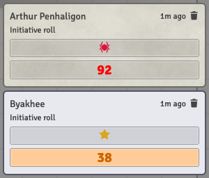

# 🙈 Hidden Initiative Rolls

> A hidden combatant's initiative roll should be the Keeper's secret. With CoC7 it wasn't. **GM only.**

When you use CoC7's **Optional** initiative rule (*Select initiative rule → Optional*, i.e. initiative is a DEX roll rather than the raw DEX value), every initiative roll produces a chat card. Foundry core makes that card private to the GM when the combatant is hidden — but CoC7 replaces Foundry's initiative code with its own and never looks at the hidden flag. Result: you hide the Byakhee in the tracker, click *Roll All*, and every player sees a chat card titled **Byakhee — Initiative roll**, success level included.

This is CoC7 issue [#2149](https://github.com/Miskatonic-Investigative-Society/CoC7-FoundryVTT/issues/2149). Until it is fixed upstream, this module closes the gap.

## What changes

- **Initiative rolls of hidden combatants are whispered to the GMs.** A combatant counts as hidden when it is hidden in the combat tracker *or* its token is hidden on the canvas (Foundry core only checks the tracker; the canvas check is stricter on purpose).
- **Players don't get a placeholder either.** Foundry normally shows non-recipients of a private roll a "*Gamemaster privately rolled some dice*" card — one per hidden NPC, which is a head-count. For initiative rolls a player may not see, that placeholder is hidden on the player's screen; the message itself is untouched and the Keeper sees the full card.
- **Visible combatants are untouched** — their rolls follow your chat roll mode exactly as before.
- **It only ever tightens visibility.** A roll that already reaches only the GMs — a GM whisper or a blind roll, whether because of your roll mode, another module, or a fixed CoC7 — is left exactly as it is. A roll players would see — public, or whispered *to them* by CoC7's **Self Roll** combined with the *Self roll whisper target: everyone* setting — is narrowed to the GMs.
- Applies to every way CoC7 rolls initiative: the tracker's per-combatant dice button, *Roll All* / *Roll NPCs*, and the *Draw gun* toggle that re-rolls initiative.

With the default **Basic** initiative rule no chat card is created at all, so there was nothing to leak and nothing changes.

## How to use it

Nothing to configure.

1. Hide the combatant — the eye icon in the combat tracker, or the token's visibility toggle on the canvas
2. Roll initiative as usual

   

   *Arthur is visible and rolls publicly; the hidden Byakhee's card arrives as a GM whisper.*

3. The card appears in your chat as a whisper to the GMs; players see nothing. Reveal the combatant and its next roll is public again

## Why this exists, and when it goes away

This is a workaround for a system bug, built to disappear cleanly:

- It never loosens a message's visibility, so whatever shape the upstream fix takes, the two cannot fight — worst case, this code becomes a silent no-op.
- When it notices that a hidden combatant's roll already reached only the GMs while your roll mode is public (and this module's own Roll Visibility dropdown was not the cause), it logs a one-line `[coc7-qol]` note in the browser console: CoC7 (or another module) now handles it, and this workaround can be removed.
- Once the fixing CoC7 version is known, a single constant in `scripts/hidden-initiative/index.js` (`UPSTREAM_FIXED_IN`) switches the whisper part off from that version on. The placeholder hiding stays — Foundry itself shows that placeholder for every private roll, so it is useful regardless of the CoC7 fix.

---

[← Back to README](../../README.md)
