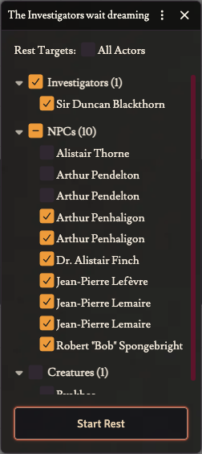

# 🛏️ Grouped Rest Targets

> Rest the Investigators in two clicks instead of hunting them down in a flat list of every actor in the world. **GM only.**

CoC7's **Start Rest** tool (Keeper's toolbar) opens a dialog listing every actor in the world — investigators, NPCs, creatures, vehicles — as one long alphabetical list with nothing pre-selected. In a mature campaign that means scrolling past dozens of "Angry Man A" entries to tick the four investigators you actually want to rest.

This tweak reorganises that dialog without changing what it does.

## What changes

- **Actors are grouped by type** — Investigators, NPCs, Creatures, and (if any exist) Vehicles — each with a count in its heading. Empty groups are hidden.
- **Investigators are pre-selected** and their group is expanded; the other groups start collapsed and unchecked.
- **Each group heading has its own select-all checkbox**, so resting every NPC, or every creature, is one click. The checkbox reflects the group's state — ticked, empty, or half-ticked when only some rows are selected.
- **All Actors** works the same way one level up: ticking it selects everyone, unticking it clears everyone, and it shows half-ticked while only part of the world is selected.
- Actors are sorted alphabetically within each group.

The **Start Rest** button behaves exactly as before, and the rest itself (HP recovery, daily sanity reset, magic points) is untouched — this only rearranges the picker.

If the world has no investigator, nothing is pre-selected and the first non-empty group is expanded instead.

> CoC7 itself meant to pre-tick the active players' characters, but a markup slip in the system puts the `checked` attribute on the label instead of the checkbox, so nothing was ever selected. Pre-selecting the Investigators here fills that gap.

## How to use it

1. Click the tentacle-strike icon in the scene controls toolbar to open the Keeper's tools
2. Click **Start Rest**
3. The Investigators are already ticked — click **Start Rest** to rest just them

   

4. Or expand a group and adjust the selection — tick the group's box to select everyone in it, then untick the exceptions. The group box goes half-ticked to show a partial selection

   

---

[← Back to README](../../README.md)
