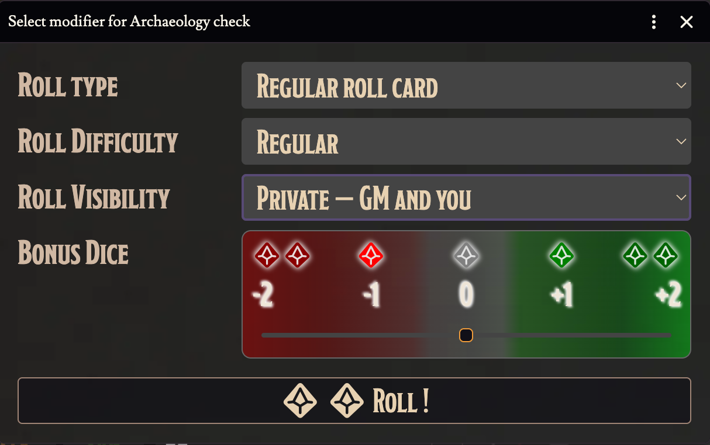

# 🎲 Roll Visibility Selector

> Stop re-picking visibility every single roll.

The CoC7 bonus/penalty dialog now includes a **roll visibility** dropdown with four options:

- **Public** — visible to everyone at the table
- **Private GM Roll** — visible only to GMs
- **Blind GM Roll** — hidden even from the GM until revealed
- **Self Roll** — visible only to you

## What changes in practice

- **Your last choice is remembered, per user.** Next time you roll, the dropdown is already on the visibility you usually use — no re-picking.
- **Standby → resolve preserves visibility.** When a deferred roll comes back to be resolved later in the round, it keeps the visibility you set when you queued it. Previously it would silently revert.

Small change. Big difference once you've made fifty rolls in a session.

---

[← Back to README](../../README.md)
