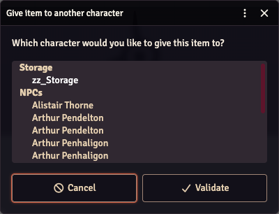

# 🎁 Grouped Trade / Store Targets

> Hand an item to the right character — or drop it in storage — without scanning a flat list of everyone in the world. **Everyone.**

CoC7's **Trade / Store Item** button (the arrows icon next to an item on the character sheet) asks "Which character would you like to give this item to?" and offers a plain dropdown of every actor you can see, in world order. Investigators, storage containers, NPCs and creatures are all mixed together, so players end up naming their storage `zz_Storage` just to push it to the bottom.

This tweak reorganises that dropdown without changing what it does.

## What changes

- **Targets are grouped by type** — Investigators, Storage, NPCs, Creatures, in that order — using native dropdown headings. Empty groups are hidden.
- **Nothing is chosen for you.** The dropdown opens on a *— Choose a character —* entry and **Validate** stays greyed out until you pick a real target, so an item can no longer be sent to whoever happened to come first in the list.
- Names are sorted alphabetically within each group.

The item transfer itself (the Keeper-side socket request) and the **Validate** / **Cancel** buttons are untouched — this only rearranges the picker. Which actors you can see is still decided by the system: players only see actors they have at least Limited permission on.

## How to use it

1. On a character sheet, hover an item and click the **Trade / Store Item** button
   

2. Open the dropdown — pick from the group you want; **Validate** lights up once you have

   

3. Click **Validate**

---

[← Back to README](../../README.md)
